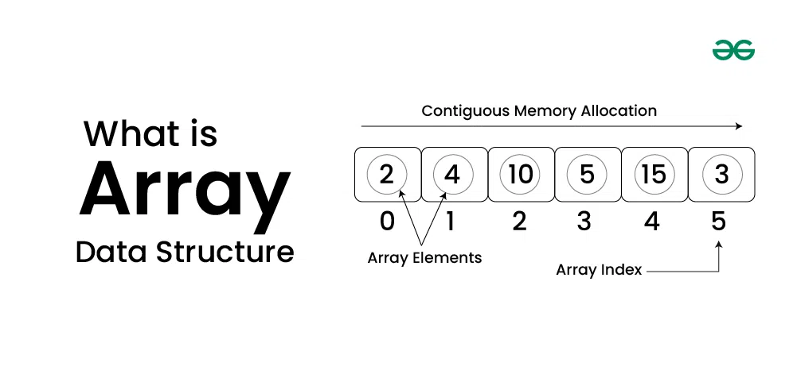

# Arrays

## Array is a linear data structure where all elements are arranged sequentially. It is a collection of elements of same data type stored at contiguous memory locations.



```js
// arrays

class MyArray {
  constructor() {
    this.arrayLength = 0;
    this.arrayData = [];
  }

  // to push the value in the last of the array
  push(value) {
    this.arrayData[this.arrayLength] = value;
    this.arrayLength++;
    return this.arrayLength;
  }

  // to display the data of the array
  get(index) {
    if (index >= this.arrayLength || index < 0) {
      return `index is out of range`;
    }
    return this.arrayData[index];
  }

  // to delete a item from the last of the array
  pop() {
    if (this.arrayLength <= 0) {
      return `underflow`;
    }
    let poppedElement = this.arrayData[this.arrayLength - 1];
    this.arrayLength = this.arrayLength - 1;
    this.arrayData.length = this.arrayLength;
    return poppedElement;
  }

  // to search an item in array
  search(value) {
    for (let i = 0; i < this.arrayLength; i++) {
      if (this.arrayData[i] === value) {
        return `${value} found at position ${i + 1}`;
      }
    }
    return `value not found`;
  }

  // to sort the array items
  sort() {
    let temp;
    for (let i = 0; i < this.arrayLength; i++) {
      for (let j = i + 1; j < this.arrayLength; j++) {
        if (this.arrayData[i] > this.arrayData[j]) {
          temp = this.arrayData[i];
          this.arrayData[i] = this.arrayData[j];
          this.arrayData[j] = temp;
        }
      }
    }
    return this.arrayData;
  }

  // shift() - removes the element from the beginning of the array
  shift() {
    if (this.arrayLength <= 0) {
      return `underflow`;
    }
    let shiftedElement = this.arrayData[0];
    for (let i = 0; i < this.arrayLength; ++i) {
      this.arrayData[i] = this.arrayData[i + 1];
    }
    this.arrayLength = this.arrayLength - 1;
    this.arrayData.length = this.arrayLength;
    return shiftedElement;
  }

  // delete() - removes the element using the index value
  delete(index) {
    if (index >= this.arrayLength || index < 0) {
      return `underflow`;
    }
    let deletedElement = this.arrayData[index];
    for (let i = index; i < this.arrayLength; ++i) {
      this.arrayData[i] = this.arrayData[i + 1];
    }
    this.arrayLength = this.arrayLength - 1;
    this.arrayData.length = this.arrayLength;
    return deletedElement;
  }

  // unshift() - add the element in the beginning of the array
  unshift(value) {
    for (let i = this.arrayLength; i > 0; i--) {
      this.arrayData[i] = this.arrayData[i - 1];
    }
    this.arrayLength++;
    this.arrayData[0] = value;
    return this.arrayData;
  }

  // insert() - add the element at the specific index of the array
  insert(index, value) {
    if (index > this.arrayLength) {
      return `index out of range`;
    }
    this.arrayLength += 1;
    for (let i = this.arrayLength - 1; i > index; i--) {
      this.arrayData[i] = this.arrayData[i - 1];
    }
    this.arrayData[index] = value;
    return this.arrayData;
  }
}

const arrayObject = new MyArray();

// push
arrayObject.push(2);
arrayObject.push(5);
arrayObject.push(9);
arrayObject.push(7);
console.log(arrayObject.arrayData);
console.log(arrayObject.arrayLength);

// get
console.log(arrayObject.get(5));
console.log(arrayObject.get(3));

// pop
console.log(arrayObject.pop());
console.log(arrayObject.arrayData);
console.log(arrayObject.arrayLength);

arrayObject.push(13);
arrayObject.push(8);
arrayObject.push(3);
console.log(arrayObject.arrayData);

// search
console.log(arrayObject.search(19));
console.log(arrayObject.search(13));

// sort()
console.log(arrayObject.sort());

// shift
console.log(arrayObject.shift());
console.log(arrayObject.arrayData);
console.log(arrayObject.arrayLength);

// delete
console.log(arrayObject.delete(2));
console.log(arrayObject.arrayData);
console.log(arrayObject.arrayLength);

// unshift()
console.log(arrayObject.unshift(8));
console.log(arrayObject.arrayData);
console.log(arrayObject.arrayLength);

// insert()
console.log(arrayObject.insert(3, 1));
console.log(arrayObject.arrayData);
console.log(arrayObject.arrayLength);
```
