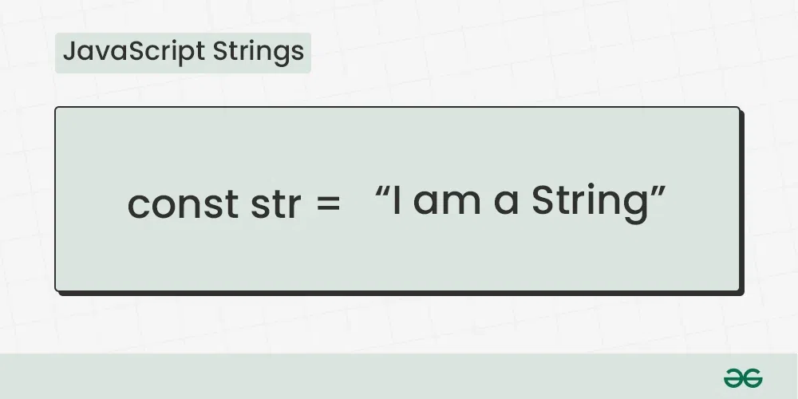

# [Strings](https://github.com/pankajkoree/react/blob/main/JS/DSA/DSA/strings/strings.js)

## **_JavaScript String is a sequence of characters, typically used to represent text. It is enclosed in single or double quotes and supports various methods for text manipulation._**



### reversing the string

```js
// problem 1: reverse the string

let originalString = "reversingthestring";
let reversedString = "";

function reverseString(originalString) {
  for (let i = originalString.length - 1; i >= 0; --i) {
    reversedString += originalString[i];
  }
  return reversedString;
}

console.log(reverseString(originalString));
```

### checking the palindrome of the string

```js
// problem 2: checking the palindrome of the string

function stringPalindromeChecker(string) {
  let reversedString = "";
  for (let i = string.length - 1; i >= 0; i--) {
    reversedString += string[i];
  }

  if (string === reversedString) {
    return true;
  } else {
    return false;
  }
}

console.log(stringPalindromeChecker("apple"));
console.log(stringPalindromeChecker("eye"));
console.log(stringPalindromeChecker("dribble"));
```

### reversing the integer

```js
// problem 3: reversing the integer

function reverseInteger(value) {
  let isNegative = value < 0;
  // absolute value of the negative number
  value = Math.abs(value);

  console.log(value);
  let reversedInteger = 0;
  while (value > 0) {
    let lastDigit = value % 10;
    reversedInteger = reversedInteger * 10 + lastDigit;
    value = Math.floor(value / 10);
  }
  if (isNegative) {
    return -reversedInteger;
  }
  return reversedInteger;
}

console.log(reverseInteger(-123));
```

### palindrome of the number

```js
// problem 4: palindrome of the number
function isPalindrome(value) {
  if (value < 0) {
    return false;
  }

  let originalValue = value;
  let palindromeValue = 0;

  while (value > 0) {
    let lastDigit = value % 10;
    palindromeValue = palindromeValue * 10 + lastDigit;
    value = Math.floor(value / 10);
  }
  return originalValue === palindromeValue;
}

console.log(isPalindrome(-123));
console.log(isPalindrome(-121));
console.log(isPalindrome(121));
console.log(isPalindrome(124));
```
