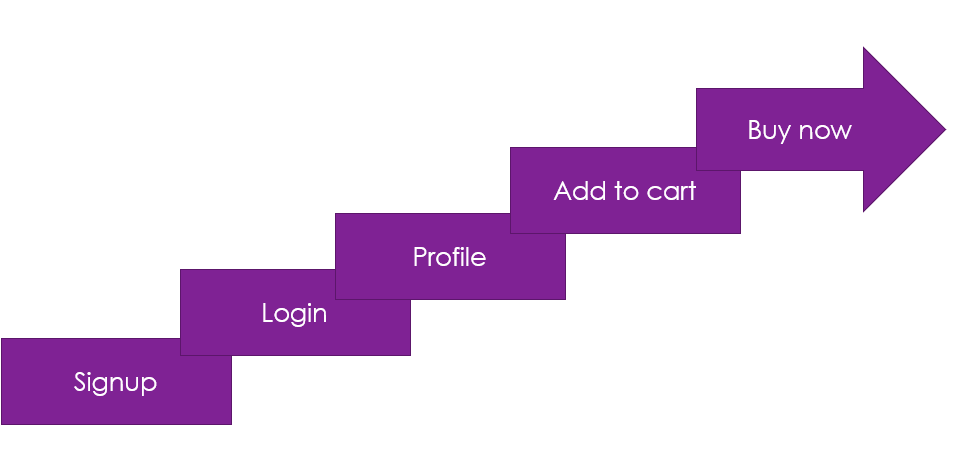

# Junior Shopping Site

> **_An e-commerce platform for medium size business_**

## Introduction

_The Junior Shopping Site is an online eCommerce platform designed specifically for small-scale retailers in local communities. With people's busy lifestyles, many prefer the ease of ordering essentials online rather than visiting physical stores, especially after a long day of work. Our platform addresses this need by offering a simple, localized solution for shopping, making it easier for people to support local businesses. For products from national or international brands, users can still shop all those items which are available on popular E-commerce platform like Amazon, Flipkart, or Alibaba, integrating both local convenience and global options into one place._

## Getting started

### Installation

1. npx create-next-app@latest
2. What is your project named? » _your_project_name_
3. Would you like to use TypeScript? » No / Yes -> No
4. Would you like to use ESLint? ... No / Yes -> Yes
5. Would you like to use Tailwind CSS? » No / Yes -> Yes
6. Would you like your code inside a `src/` directory? » No / Yes -> Yes
7. Would you like to use App Router? (recommended) » No / Yes -> Yes
8. Would you like to use Turbopack for next dev? » No / Yes -> No
9. Would you like to customize the import alias (@/\* by default)? » No / Yes -> Yes

### Clone the repository

👉 [click the link to open the files](https://github.com/pankajkoree/react/tree/main/NextJS/45ecommerce)

### Technologies

- [NextJS](https://nextjs.org/docs)
- [Tailwind CSS](https://tailwindcss.com/docs/installation)
- [MongoDB](https://www.mongodb.com/)
- [React Query](https://tanstack.com/)
- [Node mailer](https://nodemailer.com/)
- [ShadCN UI](https://ui.shadcn.com/)
- [React-hot-toast](https://react-hot-toast.com/)
- [bcryptjs](https://www.npmjs.com/package/bcryptjs)
- [JWT](https://www.npmjs.com/package/jsonwebtoken)

### Flow structure

### User perspective

👉 [Signup](https://github.com/pankajkoree/react/tree/main/NextJS/45ecommerce/src/app/signup)

👉 [Login](https://github.com/pankajkoree/react/tree/main/NextJS/45ecommerce/src/app/login)

👉 [Profile](https://github.com/pankajkoree/react/tree/main/NextJS/45ecommerce/src/app/profile/%5B...profile%5D)

👉 [Add to cart](https://github.com/pankajkoree/react/tree/main/NextJS/45ecommerce/src/app/carts)

👉 [Buy now](https://github.com/pankajkoree/react/tree/main/NextJS/45ecommerce/src/app/buyNow)

### Admin perspective

👉 [Admin code](https://github.com/pankajkoree/react/blob/main/NextJS/45ecommerce/src/app/admin/page.jsx)
